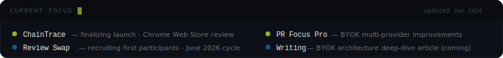
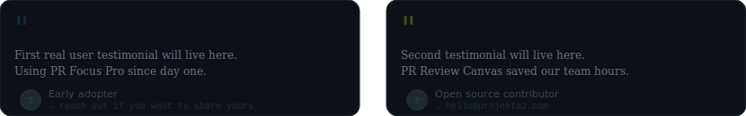

<!--
  SEO KEYWORDS (indexed by Google via GitHub):
  chrome extension developer, open source code review tool, GitHub PR triage,
  AI chrome extension BYOK, developer productivity tools, code review checklist,
  indie maker chrome extensions, manifest v3 chrome extension, pr review template,
  freelancer productivity tool, github pull request prioritization
-->

  
  &nbsp;
  

  

  

 

<!-- LIVE DASHBOARD — 4 real metrics, observability aesthetic -->

  

 

<!-- ACTIVITY BADGES ROW -->

  
  &nbsp;
  
  &nbsp;
  
  &nbsp;
  

 

 

## `> whoami` — Visual Designer who crossed into code

I'm a **Chrome extension developer and visual designer** based in Girona, Spain.
I spent years running **Projekta2 Creative Studio** — immersive web experiences where design and engineering were indistinguishable. That background shapes everything I ship.

> *I build tools for **the third week of use** — when the novelty is gone and all that's left is whether it saves you time.*

**What makes my tools different:**

| Principle | What it means |
|-----------|--------------|
| 💳 **One-time payment** | You pay once. You own it forever. No subscription tax for features that shouldn't recur. |
| 🔑 **BYOK — Bring Your Own Key** | Your API keys never leave your machine. Zero backend proxy. Zero data collection. |
| 🌍 **Bilingual from day one** | EN/ES built into the i18n architecture — not translated after the fact. |
| 🚫 **Zero telemetry** | Not even error reporting unless you explicitly opt in. |
| 🌗 **Real dark mode** | Every extension ships with dark mode from v1. Not a checkbox — a design decision. |

 

<!-- MANIFESTO VISUAL -->

  

 

 

## `> ls ~/products` — 3 Chrome extensions in production

> All extensions share the same philosophy: **one-time payment, 100% local processing, bilingual UX (EN/ES), no telemetry, no dark patterns.**

 

<!-- PRODUCT CARDS -->

  
  &nbsp;&nbsp;
  

 

  

 

<!-- CTA BUTTONS — one per product, tight row -->

**TabCost Pro** &nbsp;

&emsp;**PR Focus Pro** &nbsp;

**ChainTrace** &nbsp;

 

 

## `> cat ~/open-source` — Free tools for the developer community

> Two open-source projects built alongside the commercial extensions.
> MIT licensed. Contributions welcome. No strings attached.

 

  

 

**🎨 PR Review Canvas** — free, open-source code review kit for developers &nbsp;

**📋 Build Logs** — real engineering decisions from indie products &nbsp;

[-f97316?style=flat-square)](https://github.com/projekta2/build-logs/issues/1)

<strong>What's inside PR Review Canvas</strong> — click to expand

 

A complete, opinionated code review kit covering the full lifecycle:

- **51-item interactive checklist** — with a live "Review Readiness" score that updates as you check items
- **PR description templates** — basic and advanced, ready to copy into GitHub
- **Reviewer guides** — for beginners, for senior engineers, for giving feedback that doesn't start a flame war
- **Annotated examples** — real good and bad PRs, annotated with what works and what doesn't
- **Anti-patterns reference** — the 12 code review anti-patterns that silently slow down teams
- **Notion + Obsidian import** — copy the checklist into your own PKM system

MIT licensed. No account required. No email capture. Just open it and use it.

**→ [Try it live](https://projekta2.github.io/pr-review-canvas/) · [View on GitHub](https://github.com/projekta2/pr-review-canvas) · [Contribute](https://github.com/projekta2/pr-review-canvas/issues?q=is%3Aopen+label%3A%22good+first+issue%22)**

 

 

## `> tail -f ~/writing` — Technical writing on dev.to

> Real decisions. Real trade-offs. Real products in production. No "10 tips" articles.

| | Article | Reads well if you… |
|--|---------|-------------------|
| 🏗️ | [**I built an AI Chrome extension with zero backend cost** — exact BYOK architecture](https://dev.to/projekta2/i-built-an-ai-chrome-extension-with-zero-backend-cost-heres-the-exact-architecture-43j7) | …build Chrome extensions and want AI without a backend |
| 📊 | [**Why my Chrome extension uses a hybrid AI risk score** instead of pure AI sorting](https://dev.to/projekta2/why-my-chrome-extension-uses-a-hybrid-ai-risk-score-instead-of-pure-ai-sorting-4lfo) | …build with AI and care about determinism |
| 🔑 | [**I went BYOK instead of running my own AI backend** — the architecture decision](https://dev.to/projekta2/i-built-an-ai-priority-inbox-for-github-pull-requests-and-went-byok-instead-of-running-my-own-ai-19ij) | …think about privacy-first AI product design |
| ⏱ | [**I was spending 2 hours a day triaging GitHub PRs** — so I built an AI extension](https://dev.to/projekta2/i-was-spending-2-hours-a-day-triaging-github-prs-so-i-built-an-ai-extension-to-fix-it-10mm) | …manage multiple repos and feel the pain |
| 🎨 | [**The PR Review Canvas** — a free interactive checklist for better code reviews](https://dev.to/projekta2/the-pr-review-canvas-a-free-interactive-checklist-for-better-code-reviews-5dgi) | …want a code review process that actually sticks |
| 🧭 | [**5 UX principles for developer tools** that developers actually use](https://dev.to/projekta2/designing-developer-tools-that-developers-actually-use-5-ux-principles-i-learned-building-chrome-3lla) | …design tools for technical audiences |
| ⚙️ | [**MV2 → MV3 migration** — what broke, how I fixed it, what I'd do differently](https://dev.to/projekta2/migrating-a-chrome-extension-from-mv2-to-mv3-what-broke-how-i-fixed-it-and-what-id-do-c1e) | …are migrating or building a Chrome extension |
| 💳 | [**Freemium vs. one-time vs. subscription** — how I chose the pricing model](https://dev.to/projekta2/freemium-vs-one-time-vs-subscription-how-i-chose-the-pricing-model-for-my-chrome-extension-4jan) | …are pricing an indie product for the first time |

 

 

## `> systemctl status --now` — What I'm working on right now

  

 

 

## `> cat ~/users.feedback` — What people are saying

> *Building in public since May 2026 — first testimonials incoming. Using PR Focus Pro or PR Review Canvas?* ***[Share your experience →](mailto:hello@projekta2.com)***

  

 

 

## `> lspci | grep stack` — Tech I build with

  

 

<!-- GitHub stats row — adds social proof, activity signal, indexed content -->

  
  &nbsp;
  

 

 

## `> ssh hire@projekta2.com` — Work together

<table width="100%">
  <tr>
    <td width="22%" valign="middle" align="center">
      
        
      
    </td>
    <td width="78%" valign="middle">

**Clients** — All three extensions are live and free to install. The best way to evaluate my work is to use it. Custom Chrome extension development available on request — bring a problem, I'll build the tool.

**Employers / freelance** — Unusual combination in the market: production-level visual design + working knowledge of Chrome Extension APIs, AI integration (BYOK, prompt engineering), DOM extraction, Google Sheets API, and JavaScript from scratch. I care about UX that doesn't need a tutorial.

**Open-source community** — [PR Review Canvas](https://github.com/projekta2/pr-review-canvas) and [Build Logs](https://github.com/projekta2/build-logs) are both actively maintained and open to contributions. If you want to make your first open-source contribution, there are [good first issues waiting](https://github.com/projekta2/pr-review-canvas/issues?q=is%3Aopen+label%3A%22good+first+issue%22).

  
  
  

  </td>
  </tr>
</table>

 

<!-- CONTRIBUTORS section — social proof, invites participation -->
## `> git log --all --oneline --author=community`

*Contributions to [PR Review Canvas](https://github.com/projekta2/pr-review-canvas) are open and welcome. Your avatar could appear here.*

*First external contributor = instant feature in Build Logs.*

 

  
    <i>
      Building in public · Girona, Spain · May 2026 → present 
      <a href="https://github.com/projekta2/pr-review-canvas">⭐ Star PR Review Canvas</a> ·
      <a href="https://github.com/projekta2/build-logs/issues/1">Join the Review Swap</a> ·
      <a href="https://dev.to/projekta2">Read the articles</a>
    </i>
  

  

