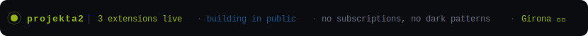
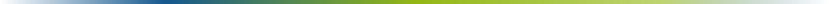
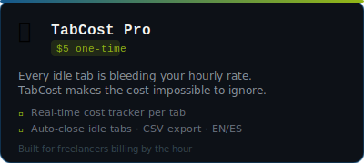
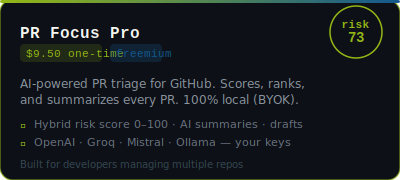
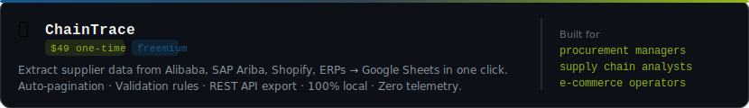
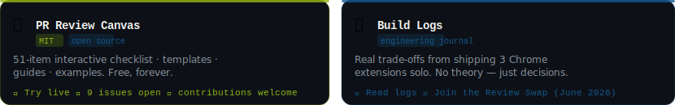
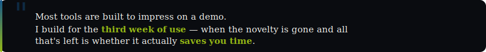
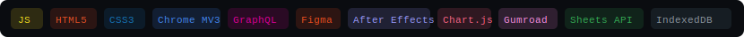

  
  &nbsp;
  

  

  

 

<!-- STATUS BAR — commit assets/status-bar.svg to this repo -->

  

 

<!-- DIVIDER -->

 

## `> whoami`

I'm a Visual Designer who crossed into code — not by accident, but because **the tools I wanted didn't exist yet.**

I spent years running **Projekta2 Creative Studio**, building immersive web experiences at the intersection of design and engineering: the kind where you weren't sure if you were looking at a website or an installation.

That background shapes everything I ship:
- **Obsession with detail** — dark mode that actually works, spacing that breathes, interactions that feel intentional
- **Bilingual from day one** — EN/ES built into the architecture, not bolted on later
- **Anti-dark-patterns** — no fake urgency, no bait-and-switch freemium, no telemetry

Now I build **Chrome extensions** for freelancers and developers, and **open-source resources** for the community.

 

<!-- DIVIDER -->

 

## `> ls ~/products`

<!-- PRODUCT CARDS — commit assets/card-tabcost.svg and assets/card-prfocus.svg -->

  
  &nbsp;&nbsp;
  

 

<!-- ChainTrace full width -->

  

 

<!-- CTA buttons row -->

**TabCost Pro** &nbsp;→&nbsp;

&nbsp;&nbsp;&nbsp;**PR Focus Pro** &nbsp;→&nbsp;

**ChainTrace** &nbsp;→&nbsp;

 

<!-- DIVIDER -->

 

## `> cat ~/open-source`

<!-- OPEN SOURCE PANEL — commit assets/opensource-panel.svg -->

  

 

**PR Review Canvas** &nbsp;→&nbsp;

&nbsp;&nbsp;&nbsp;**Build Logs** &nbsp;→&nbsp;

 

<!-- DIVIDER -->

 

## `> cat ~/writing`

> Articles on [dev.to/projekta2](https://dev.to/projekta2) — real decisions from real products in production.

| | Article | Tags |
|--|---------|------|
| 📊 | [Why my Chrome extension uses a hybrid AI risk score instead of pure AI sorting](https://dev.to/projekta2/why-my-chrome-extension-uses-a-hybrid-ai-risk-score-instead-of-pure-ai-sorting-4lfo) | `#ai` `#chrome-extension` `#architecture` |
| 🔑 | [I built an AI priority inbox for GitHub PRs — and went BYOK instead of running my own AI](https://dev.to/projekta2/i-built-an-ai-priority-inbox-for-github-pull-requests-and-went-byok-instead-of-running-my-own-ai-19ij) | `#showdev` `#privacy` `#ai` |
| ⏱ | [I was spending 2 hours a day triaging GitHub PRs — so I built an AI extension to fix it](https://dev.to/projekta2/i-was-spending-2-hours-a-day-triaging-github-prs-so-i-built-an-ai-extension-to-fix-it-10mm) | `#productivity` `#github` |
| 🎨 | [The PR Review Canvas — a free interactive checklist for better code reviews](https://dev.to/projekta2/the-pr-review-canvas-a-free-interactive-checklist-for-better-code-reviews-5dgi) | `#opensource` `#codereview` |
| 🧭 | [Designing developer tools that developers actually use — 5 UX principles](https://dev.to/projekta2/designing-developer-tools-that-developers-actually-use-5-ux-principles-i-learned-building-chrome-3lla) | `#ux` `#devtools` `#design` |
| 🔄 | [Migrating a Chrome extension from MV2 to MV3: what broke, how I fixed it](https://dev.to/projekta2/migrating-a-chrome-extension-from-mv2-to-mv3-what-broke-how-i-fixed-it-and-what-id-do-c1e) | `#chrome-extension` `#mv3` |
| 💳 | [Freemium vs. one-time vs. subscription: how I chose the pricing model](https://dev.to/projekta2/freemium-vs-one-time-vs-subscription-how-i-chose-the-pricing-model-for-my-chrome-extension-4jan) | `#indiehacker` `#pricing` |

 

<!-- DIVIDER -->

 

## `> cat ~/philosophy`

  

 

**What that means in practice:**

- 💳 **One-time payments** — you pay once, you own it. No subscription for features that shouldn't be recurring.
- 🔑 **BYOK (Bring Your Own Key)** — your API keys stay on your machine. No backend proxy, no data collection.
- 🌗 **Dark mode done right** — not an afterthought. Every extension ships with a real dark mode from v1.
- 🌍 **Bilingual from day one** — EN/ES built into the i18n architecture, not translated afterwards.
- 🚫 **No telemetry** — none. Not even error reporting unless you opt in.

 

<!-- DIVIDER -->

 

## `> lspci | grep stack`

  

 

<!-- DIVIDER -->

 

## `> ssh hire@projekta2.com`

<table width="100%">
  <tr>
    <td width="22%" valign="middle" align="center">
      
    </td>
    <td width="78%" valign="middle">

**Clients** — All three extensions are live. The best way to evaluate my work is to use them. Custom Chrome extension development available on request.

**Employers / freelance** — Unusual combination: production-level visual design + working knowledge of Chrome Extension APIs, AI integration, DOM extraction, and JS from scratch. I care about UX that doesn't need a tutorial.

**Open-source community** — Two maintained public resources: [PR Review Canvas](https://github.com/projekta2/pr-review-canvas) (code review kit, MIT) and [Build Logs](https://github.com/projekta2/build-logs) (engineering decisions). Both open to contributions.

  
  
  

  </td>
  </tr>
</table>

 

  <i>Building in public · Girona, Spain · May 2026 → </i>

  

